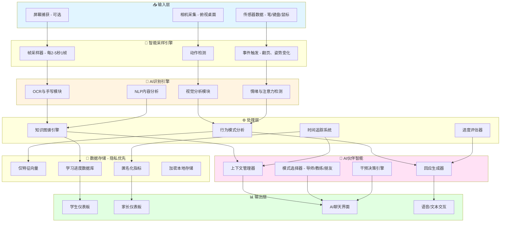

# AI陪伴学习系统 - 架构设计文档

## 📐 系统概述

AI陪伴学习系统通过以下方式将传统监督转变为智能陪伴：
- **基于视觉的行为分析**（非侵入式、隐私安全）
- **多模态学习理解**（OCR、手写、内容识别）
- **情感智能**（疲劳检测、激励、鼓励）
- **自适应交互**（导师/教练/朋友模式）
- **渐进式学习追踪**（知识图谱、个性化路径）

---

## 🏗️ 系统架构



---

## 🔧 核心模块

### 1. 视觉分析模块

**职责：**
- 检测学生姿势（驼背、倾斜、端正）
- 追踪视线方向和专注时长
- 识别面部表情（专注、困惑、疲劳）
- 检测手/笔活动

**技术栈：**
- MediaPipe用于姿势估计
- OpenCV用于图像处理
- 预训练情绪识别模型（FER+、AffectNet）

**隐私保护：**
- 不存储视频，仅保存特征向量
- 情绪推理后即丢弃面部嵌入

---

### 2. OCR与手写识别模块

**职责：**
- 从笔记本、教科书、屏幕提取文本
- 识别手写答案和练习题
- 检测数学方程和图表
- 通过模式匹配识别正确性

**技术栈：**
- PaddleOCR（中文+英文）
- Google Cloud Vision API（可选）
- 自定义手写模型（按需）

**输出：**
- 带时间戳的结构化文本
- 主题标签（如"数学 - 二次方程"）
- 难度估计

---

### 3. 知识图谱引擎

**职责：**
- 将检测到的内容映射到知识领域
- 构建个性化学习路径
- 按主题追踪掌握水平
- 建议下一步学习内容

**结构：**
```
知识图谱模式：
- 学科 → 章节 → 主题 → 概念 → 练习
- 难度：[简单、中等、困难]
- 掌握度：[0-100%]
- 前置知识：[概念列表]
```

**技术栈：**
- Neo4j或内存图（NetworkX）
- 基于BERT的NLP主题建模

---

### 4. 时间追踪与行为检测

**职责：**
- 检测学习状态：**活跃、空闲、休息、返回**
- 测量专注学习时间 vs. 分心时间
- 追踪会话时长和频率
- 检测模式（如高效时段、疲劳周期）

**逻辑：**
```python
状态：
- 活跃：检测到书写/阅读，视线在桌面
- 空闲：超过2分钟无活动
- 分心：视线移开，无笔动作
- 疲劳：姿势萎靡，揉眼睛
```

---

### 5. AI伙伴聊天系统

**模式：**

#### 🎓 导师模式
- 解释困难概念
- 提供提示而不直接给答案
- 提出苏格拉底式问题

**示例：**
> "我看到你在做因式分解。让我问你：你注意到系数有什么规律吗？"

#### 💪 教练模式
- 追踪进度并提供反馈
- 庆祝成就
- 设定微目标

**示例：**
> "你今天已经完成了8道题——势头很好！能冲10道吗？"

#### 🤗 朋友模式
- 同理心对话
- 挫折时的情感支持
- 随意打招呼

**示例：**
> "看起来你已经在这个问题上花了一个小时了。要不要聊点别的放松一下？"

**技术栈：**
- LLM后端（GPT-4、Claude或开源如Llama）
- 上下文窗口包含最近的学习事件
- 可配置的语调和个性

---

### 6. 仪表板系统

#### 学生仪表板
**功能：**
- 每日/每周学习时间可视化
- 主题掌握度雷达图
- 近期成就和连续打卡
- AI伙伴对话历史
- 个性化推荐

#### 家长仪表板
**功能：**
- 匿名化进度总结
- 时间投入趋势（无实时监控）
- 按学科分类的表现
- AI生成的洞察（如"数学技能稳步提高"）
- 可选的每周报告

**隐私控制：**
- 家长仅看**汇总数据**，无实时监控
- 学生可隐藏特定会话（标记为"私人学习"）

---

## 🔒 隐私与安全架构

### 原则

1. **本地优先处理**：尽可能在设备上进行所有AI推理
2. **不连续录制**：仅保存关键帧（每2-5秒1帧）为特征向量
3. **加密存储**：本地数据库使用SQLCipher加密
4. **数据最小化**：特征提取后丢弃原始图像
5. **用户控制**：学生可随时暂停/禁用监控

### 数据生命周期

```
相机帧 → 帧采样 → 特征提取 → 加密存储
   ↓         ↓          ↓          ↓
(丢弃)    (特征)    (AI分析)   (仪表板)
```

---

## 📊 数据模型

### 会话记录
```json
{
  "session_id": "uuid",
  "student_id": "uuid",
  "start_time": "2025-10-31T10:00:00Z",
  "end_time": "2025-10-31T10:45:00Z",
  "total_time": 2700,
  "focused_time": 2400,
  "idle_time": 300,
  "detected_topics": ["数学 - 代数", "物理 - 力学"],
  "emotion_summary": {
    "concentrated": 0.7,
    "confused": 0.2,
    "fatigued": 0.1
  },
  "ai_interactions": 5,
  "achievements": ["45分钟连续学习", "完成10道题"]
}
```

### 知识状态
```json
{
  "student_id": "uuid",
  "knowledge_map": {
    "数学.代数.二次方程": {
      "mastery": 0.75,
      "last_practiced": "2025-10-31T10:00:00Z",
      "exercises_completed": 23,
      "avg_correctness": 0.82
    }
  }
}
```

---

## 🚀 技术栈

### 后端
- **语言**：Python 3.10+
- **框架**：FastAPI（REST API + WebSockets）
- **AI/ML**：
  - OpenCV、MediaPipe（视觉）
  - PaddleOCR（文本识别）
  - Transformers（NLP）
  - scikit-learn（模式分析）
- **数据库**：SQLite（本地）、PostgreSQL（可选云端）
- **LLM集成**：OpenAI API / Anthropic Claude / 本地LLM

### 前端
- **框架**：React + TypeScript
- **UI库**：Material-UI / Ant Design
- **图表**：Recharts / D3.js
- **实时**：Socket.IO

### 部署
- **本地**：Docker Compose
- **边缘设备**：树莓派4 / NVIDIA Jetson Nano（用于相机）
- **云端（可选）**：AWS/GCP用于备份和高级模型

---

## 🎯 AI伙伴交互逻辑

### 干预决策树

```
每30秒检查一次：

如果 空闲时间 > 180秒 且 未在休息：
    → "你已经有3分钟没动了，需要休息吗？"

如果 专注时间 > 25*60秒 且 最近未打断：
    → "你已经专注了25分钟——做得好！要休息5分钟吗？"

如果 情绪 == "困惑" 持续 > 5分钟：
    → "我注意到你卡住了。要我解释一下这个概念吗？"

如果 姿势 == "驼背" 持续 > 10分钟：
    → "你的姿势看起来不太舒服。我们伸展一下吧！"

如果 会话结束 且 今天完成的练习 > 昨天：
    → "太棒了！你比昨天多完成了3道题！"
```

---

## 🧪 示例工作流

### 工作流1：作业会话
1. 学生坐下，相机检测到开始
2. OCR识别"数学作业 - 第5章"
3. 知识图谱将主题标记为"代数 - 方程组"
4. 学生工作15分钟（追踪为专注时间）
5. AI检测到困惑（面部表情 + 在一道题上长时间停顿）
6. AI伙伴（导师模式）："这道题看起来有点棘手。你试过消元法了吗？"
7. 学生继续，完成作业
8. 仪表板更新：+45分钟学习时间，代数掌握度：68% → 72%

### 工作流2：疲劳检测
1. 相机检测到学生揉眼睛、驼背
2. 时间追踪器显示连续学习90分钟
3. AI伙伴（朋友模式）："你已经很努力学习了！你的大脑需要休息。要做一个2分钟的眼部运动吗？"
4. 学生接受，休息
5. 返回后精神焕发，AI欢迎回来："准备好继续了吗？你做得很棒！"

---

## 🔮 未来增强

- **多学生支持**（教室模式）
- **游戏化**（经验值、徽章、排行榜）
- **AR覆盖**（在桌面上投影提示/反馈）
- **纯语音模式**（学习期间免提交互）
- **家长-学生协作目标设定**
- **与在线学习平台集成**（Khan Academy、Coursera）

---

## 📚 参考资料

- MediaPipe：https://google.github.io/mediapipe/
- PaddleOCR：https://github.com/PaddlePaddle/PaddleOCR
- 隐私保护机器学习：联邦学习、差分隐私
- 教育心理学：间隔效应、番茄工作法、心流状态

---

**版本**：1.0
**最后更新**：2025-10-31
**维护者**：AI系统架构团队
