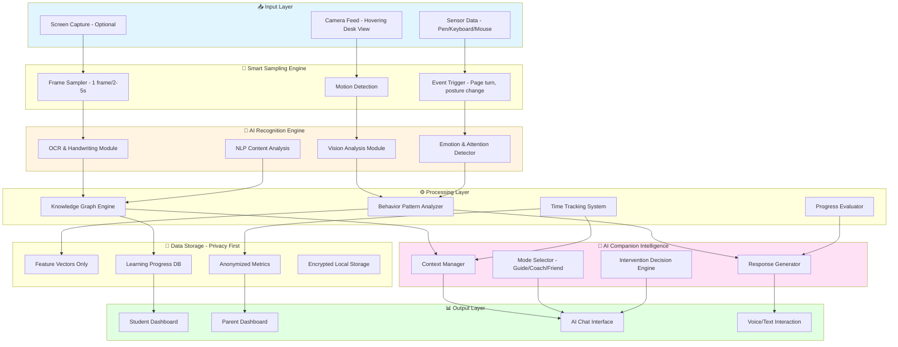

# AI Learning Companion System - Architecture Design

## 📐 System Overview

The AI Learning Companion System transforms traditional supervision into intelligent companionship through:
- **Vision-based behavior analysis** (non-invasive, privacy-safe)
- **Multi-modal learning understanding** (OCR, handwriting, content recognition)
- **Emotional intelligence** (fatigue detection, motivation, encouragement)
- **Adaptive interaction** (Guide/Coach/Friend modes)
- **Progressive learning tracking** (knowledge graphs, personalized paths)

---

## 🏗️ System Architecture



---

## 🔧 Core Modules

### 1. Vision Analysis Module
**Responsibilities:**
- Detect student posture (slouching, leaning, upright)
- Track gaze direction and focus duration
- Recognize facial expressions (concentration, confusion, fatigue)
- Detect hand/pen activity

**Technologies:**
- MediaPipe for pose estimation
- OpenCV for image processing
- Pre-trained emotion recognition models (FER+, AffectNet)

**Privacy:**
- No video storage, only feature vectors
- Face embeddings discarded after emotion inference

---

### 2. OCR & Handwriting Recognition Module
**Responsibilities:**
- Extract text from notebooks, textbooks, screens
- Recognize handwritten answers and exercises
- Detect mathematical equations and diagrams
- Identify correctness through pattern matching

**Technologies:**
- PaddleOCR (Chinese + English)
- Google Cloud Vision API (optional)
- Custom handwriting model (if needed)

**Output:**
- Structured text with timestamps
- Topic tags (e.g., "Math - Quadratic Equations")
- Difficulty estimation

---

### 3. Knowledge Graph Engine
**Responsibilities:**
- Map detected content to knowledge domains
- Build personalized learning paths
- Track mastery levels by topic
- Suggest next learning steps

**Structure:**
```
Knowledge Graph Schema:
- Subject → Chapter → Topic → Concept → Exercise
- Difficulty: [Easy, Medium, Hard]
- Mastery: [0-100%]
- Prerequisites: [List of concepts]
```

**Technologies:**
- Neo4j or in-memory graph (NetworkX)
- NLP topic modeling (BERT-based)

---

### 4. Time Tracking & Behavior Detection
**Responsibilities:**
- Detect learning states: **Active, Idle, Break, Return**
- Measure focused study time vs. distraction time
- Track session duration and frequency
- Detect patterns (e.g., productive hours, fatigue cycles)

**Logic:**
```python
States:
- ACTIVE: Writing/reading detected, gaze on desk
- IDLE: No activity for >2 minutes
- DISTRACTED: Gaze away, no pen movement
- FATIGUED: Slumped posture, rubbing eyes
```

---

### 5. AI Companion Chat System
**Modes:**

#### 🎓 Guide Mode
- Explains difficult concepts
- Provides hints without giving away answers
- Asks Socratic questions

**Example:**
> "I see you're working on factoring polynomials. Let me ask: what do you notice about the coefficients?"

#### 💪 Coach Mode
- Tracks progress and provides feedback
- Celebrates achievements
- Sets micro-goals

**Example:**
> "You've completed 8 problems today—great momentum! Can you aim for 10?"

#### 🤗 Friend Mode
- Empathetic conversation
- Emotional support during frustration
- Casual check-ins

**Example:**
> "Looks like you've been at this for an hour. Want to chat about something else for a minute?"

**Technologies:**
- LLM backend (GPT-4, Claude, or open-source like Llama)
- Context window includes recent learning events
- Tone and personality configured per student

---

### 6. Dashboard System

#### Student Dashboard
**Features:**
- Daily/weekly learning time visualization
- Topic mastery radar chart
- Recent achievements and streaks
- AI companion conversation history
- Personalized recommendations

#### Parent Dashboard
**Features:**
- Anonymized progress summaries
- Time investment trends (no live surveillance)
- Subject-wise performance
- AI-generated insights (e.g., "Math skills improving steadily")
- Optional weekly reports

**Privacy Controls:**
- Parents see **aggregated data only**, no live feed
- Student can hide specific sessions (flagged as "private study")

---

## 🔒 Privacy & Security Architecture

### Principles
1. **Local-first processing**: All AI inference runs on-device when possible
2. **No continuous recording**: Only keyframes (1 per 2-5s) saved as feature vectors
3. **Encrypted storage**: SQLite with SQLCipher for local DB
4. **Data minimization**: Discard raw images after feature extraction
5. **User control**: Student can pause/disable monitoring anytime

### Data Lifecycle
```
Camera Feed → Frame Sampling → Feature Extraction → Encrypted Storage
                  ↓                       ↓                ↓
             (Discarded)          (AI Analysis)     (Dashboard)
```

---

## 📊 Data Models

### Session Record
```json
{
  "session_id": "uuid",
  "student_id": "uuid",
  "start_time": "2025-10-31T10:00:00Z",
  "end_time": "2025-10-31T10:45:00Z",
  "total_time": 2700,
  "focused_time": 2400,
  "idle_time": 300,
  "detected_topics": ["Math - Algebra", "Physics - Mechanics"],
  "emotion_summary": {
    "concentrated": 0.7,
    "confused": 0.2,
    "fatigued": 0.1
  },
  "ai_interactions": 5,
  "achievements": ["45min_streak", "completed_10_problems"]
}
```

### Knowledge State
```json
{
  "student_id": "uuid",
  "knowledge_map": {
    "Math.Algebra.Quadratics": {
      "mastery": 0.75,
      "last_practiced": "2025-10-31T10:00:00Z",
      "exercises_completed": 23,
      "avg_correctness": 0.82
    }
  }
}
```

---

## 🚀 Technology Stack

### Backend
- **Language**: Python 3.10+
- **Framework**: FastAPI (REST API + WebSockets)
- **AI/ML**:
  - OpenCV, MediaPipe (vision)
  - PaddleOCR (text recognition)
  - Transformers (NLP)
  - scikit-learn (pattern analysis)
- **Database**: SQLite (local), PostgreSQL (optional cloud)
- **LLM Integration**: OpenAI API / Anthropic Claude / Local LLM

### Frontend
- **Framework**: React + TypeScript
- **UI Library**: Material-UI / Ant Design
- **Charts**: Recharts / D3.js
- **Real-time**: Socket.IO

### Deployment
- **Local**: Docker Compose
- **Edge Device**: Raspberry Pi 4 / NVIDIA Jetson Nano (for camera)
- **Cloud (optional)**: AWS/GCP for backups and advanced models

---

## 🎯 AI Companion Interaction Logic

### Decision Tree for Interventions

```
Check every 30 seconds:

IF idle_time > 180s AND not on_break:
    → "You've been idle for 3 minutes. Need a break?"

IF focused_time > 25*60s AND not_interrupted_recently:
    → "You've been focused for 25 minutes—great job! Take a 5-min break?"

IF emotion == "confused" for > 5 minutes:
    → "I notice you're stuck. Want me to explain this concept?"

IF posture == "slouched" for > 10 minutes:
    → "Your posture looks uncomfortable. Let's stretch!"

IF session_end AND exercises_completed > yesterday:
    → "Awesome! You completed 3 more exercises than yesterday!"
```

---

## 🧪 Example Workflows

### Workflow 1: Homework Session
1. Student sits down, camera detects start
2. OCR recognizes "Math homework - Chapter 5"
3. Knowledge graph tags topic as "Algebra - Systems of Equations"
4. Student works for 15 minutes (tracked as focused time)
5. AI detects confusion (facial expression + long pause on one problem)
6. AI Companion (Guide mode): "That problem looks tricky. Have you tried the elimination method?"
7. Student continues, completes homework
8. Dashboard updates: +45 minutes study time, Algebra mastery: 68% → 72%

### Workflow 2: Fatigue Detection
1. Camera detects student rubbing eyes, slouching
2. Time tracker shows 90 minutes of continuous study
3. AI Companion (Friend mode): "You've been studying hard! Your brain needs a break. Want to do a quick 2-minute eye exercise?"
4. Student accepts, takes break
5. Returns refreshed, AI welcomes back: "Ready to continue? You're doing great!"

---

## 🔮 Future Enhancements
- **Multi-student support** (classroom mode)
- **Gamification** (XP, badges, leaderboards)
- **AR overlay** (project hints/feedback on desk surface)
- **Voice-only mode** (hands-free interaction during study)
- **Parent-student collaborative goal setting**
- **Integration with online learning platforms** (Khan Academy, Coursera)

---

## 📚 References
- MediaPipe: https://google.github.io/mediapipe/
- PaddleOCR: https://github.com/PaddlePaddle/PaddleOCR
- Privacy-preserving ML: Federated Learning, Differential Privacy
- Educational Psychology: Spacing effect, Pomodoro Technique, Flow State

---

**Version**: 1.0
**Last Updated**: 2025-10-31
**Maintainer**: AI Systems Architecture Team
